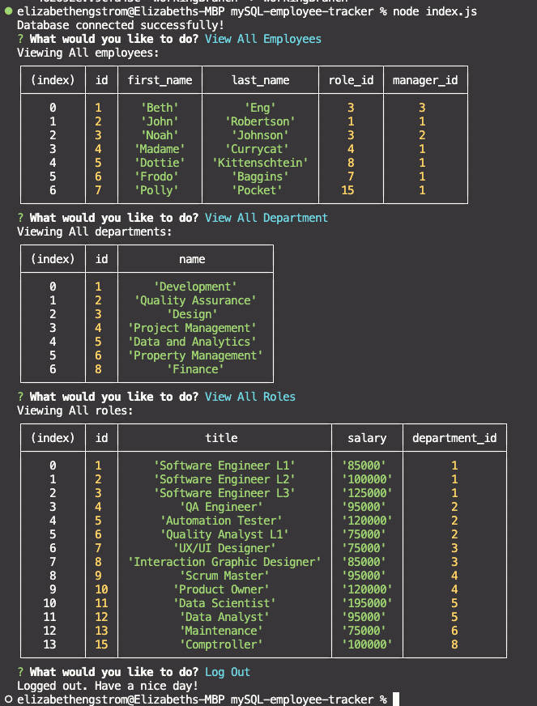

# mySQL-employee-tracker

## Technologies


## Description
A command line application to manage a companies employee database, using Node.js, Inquirer, and MySQL

## Installation
**Requirements**

[Node.js](https://nodejs.org/en/) | [Inquirer](https://www.npmjs.com/package/inquirer) | [MySQL](https://www.npmjs.com/package/mysql2)

***Once Installed:***
1. Clone the repository at the gitHub in the link section below
2. Open new session of terminal/shell and navigate to path directory where ```node index.js``` is
3. Run  ```npm install```
4. Then run ```node index.js``` to run the app
5. Connection message will appear along with prompts to begin

## User Story
```
AS A business owner
I WANT to be able to view and manage the departments, roles, and employees in my company
SO THAT I can organize and plan my business
```

## Acceptance Criteria
```
GIVEN a command-line application that accepts user input
WHEN I start the application
THEN I am presented with the following options: view all departments, view all roles, view all employees, add a department, add a role, add an employee, and update an employee role
WHEN I choose to view all departments
THEN I am presented with a formatted table showing department names and department ids
WHEN I choose to view all roles
THEN I am presented with the job title, role id, the department that role belongs to, and the salary for that role
WHEN I choose to view all employees
THEN I am presented with a formatted table showing employee data, including employee ids, first names, last names, job titles, departments, salaries, and managers that the employees report to
WHEN I choose to add a department
THEN I am prompted to enter the name of the department and that department is added to the database
WHEN I choose to add a role
THEN I am prompted to enter the name, salary, and department for the role and that role is added to the database
WHEN I choose to add an employee
THEN I am prompted to enter the employee’s first name, last name, role, and manager, and that employee is added to the database
WHEN I choose to update an employee role
THEN I am prompted to select an employee to update and their new role and this information is updated in the database
```

## Screenshot


## Video
A link to the [Video](https://watch.screencastify.com/v/AJ8meTJtDwkHZybM9Yq0):
```
https://watch.screencastify.com/v/AJ8meTJtDwkHZybM9Yq0
```

## Link
A link to the [code](https://github.com/betheng/mySQL-employee-tracker):
```
https://github.com/betheng/mySQL-employee-tracker
```

## License
  
  Licensed under the [MIT](LICENSE) license.

## Contact
Creators GitHub link [code](https://github.com/betheng ):
```
https://github.com/betheng 
```